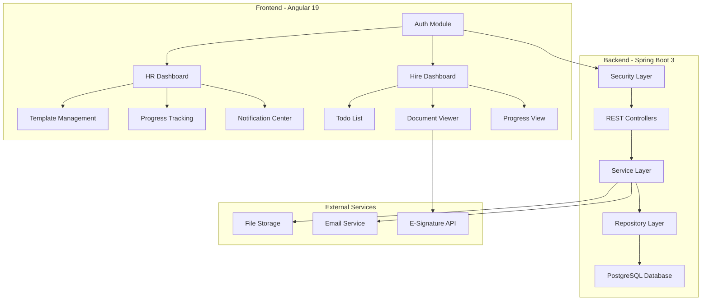
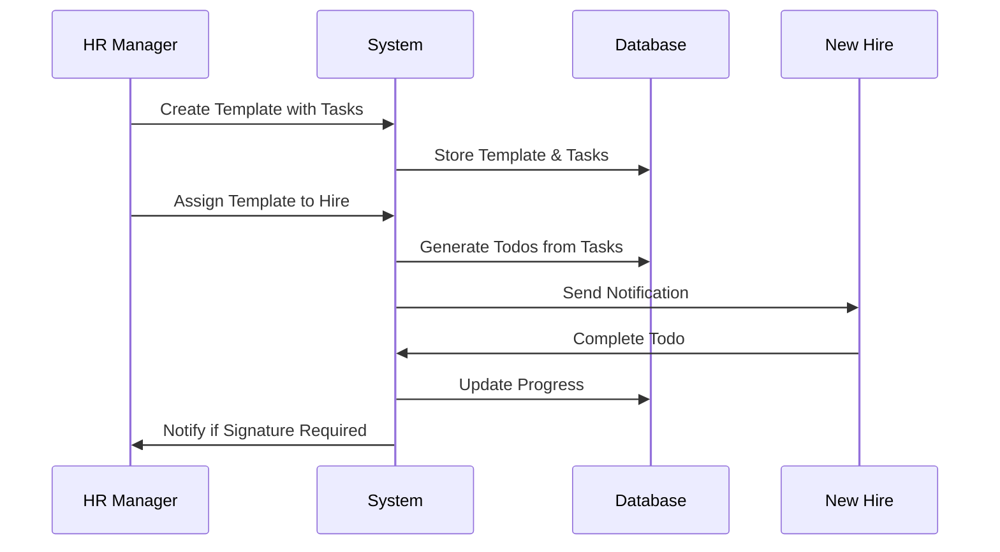

# Design Document

## Overview

Boardify's redesigned architecture follows a modern, scalable approach with clear separation of concerns between frontend and backend. The system maintains the existing color scheme while implementing a robust template-based onboarding workflow that supports role-based access, automated task generation, progress tracking, and document management with e-signature capabilities.

The core design principle centers around the Template → Todo workflow: HR managers create reusable templates containing ordered tasks, which generate individual todos when assigned to new hires. This approach ensures consistency while allowing customization per department and role.

## Architecture

### System Architecture



### Data Flow Architecture



## Components and Interfaces

### Frontend Component Architecture

#### Core Modules

1. **Auth Module**
   - `LoginComponent`: JWT-based authentication with role detection
   - `RegisterComponent`: HR registration with company creation
   - `AuthGuard`: Route protection based on user roles
   - `AuthInterceptor`: Token injection and refresh handling

2. **HR Dashboard Module**
   - `DashboardComponent`: Overview with progress metrics and notifications
   - `TemplateListComponent`: Template CRUD operations with filtering
   - `TemplateCreateComponent`: Template builder with task management
   - `HireManagementComponent`: New hire registration and template assignment
   - `ProgressTrackingComponent`: Real-time progress monitoring
   - `NotificationCenterComponent`: Signature approvals and reminders

3. **Hire Dashboard Module**
   - `HireDashboardComponent`: Personalized todo list with progress
   - `TodoItemComponent`: Individual task completion interface
   - `DocumentViewerComponent`: Document display with signature integration
   - `ProgressViewComponent`: Visual progress tracking
   - `TeamIntroductionComponent`: Team member profiles and videos

4. **Template Management Module**
   - `TemplateBuilderComponent`: Drag-and-drop task ordering
   - `TaskCreatorComponent`: Task type selection and configuration
   - `DocumentUploaderComponent`: File upload with validation
   - `TemplateAssignmentComponent`: Bulk assignment to departments/hires

5. **Shared Module**
   - `NotificationComponent`: Toast notifications and alerts
   - `ProgressBarComponent`: Reusable progress visualization
   - `FileUploaderComponent`: Standardized file upload interface
   - `CalendarComponent`: Event scheduling and viewing
   - `ConfirmDialogComponent`: Action confirmations

#### State Management (NgRx)

```typescript
interface AppState {
  auth: AuthState;
  templates: TemplateState;
  todos: TodoState;
  notifications: NotificationState;
  progress: ProgressState;
}

interface AuthState {
  user: User | null;
  token: string | null;
  isAuthenticated: boolean;
  loading: boolean;
}

interface TemplateState {
  templates: Template[];
  selectedTemplate: Template | null;
  loading: boolean;
  error: string | null;
}
```

### Backend API Architecture

#### Controller Layer

1. **AuthController**
   - `POST /api/auth/register` - HR registration with company
   - `POST /api/auth/login` - JWT authentication
   - `POST /api/auth/refresh` - Token refresh
   - `POST /api/auth/logout` - Session cleanup

2. **TemplateController**
   - `GET /api/templates` - List templates by company
   - `POST /api/templates` - Create new template
   - `PUT /api/templates/{id}` - Update template
   - `DELETE /api/templates/{id}` - Delete template
   - `POST /api/templates/{id}/assign` - Assign to hires

3. **TaskController**
   - `POST /api/templates/{templateId}/tasks` - Add task to template
   - `PUT /api/tasks/{id}` - Update task details
   - `DELETE /api/tasks/{id}` - Remove task from template
   - `POST /api/tasks/{id}/upload` - Upload task document

4. **TodoController**
   - `GET /api/todos/hire/{hireId}` - Get hire's todos
   - `PUT /api/todos/{id}/complete` - Mark todo complete
   - `POST /api/todos/{id}/reminder` - Send manual reminder

5. **ProgressController**
   - `GET /api/progress/hire/{hireId}` - Individual progress
   - `GET /api/progress/company/{companyId}` - Company overview
   - `GET /api/progress/department/{deptId}` - Department metrics

6. **NotificationController**
   - `GET /api/notifications/hr/{hrId}` - HR notifications
   - `PUT /api/notifications/{id}/read` - Mark as read
   - `POST /api/notifications/reminder` - Send reminder

#### Service Layer

```java
@Service
public class TemplateService {
    public Template createTemplate(CreateTemplateRequest request);
    public List<Template> getTemplatesByCompany(Integer companyId);
    public Template assignTemplateToHire(Integer templateId, Integer hireId);
    public void generateTodosFromTemplate(Template template, Hire hire);
}

@Service
public class ProgressService {
    public ProgressSummary calculateHireProgress(Integer hireId);
    public void updateProgressOnTodoCompletion(Integer todoId);
    public List<ProgressSummary> getCompanyProgress(Integer companyId);
}

@Service
public class NotificationService {
    public void createSignatureNotification(Integer todoId);
    public void sendReminderNotification(Integer todoId);
    public List<Notification> getHrNotifications(Integer hrId);
}
```

## Data Models

### Core Entities

#### User Hierarchy
```java
@Entity
@Inheritance(strategy = InheritanceType.JOINED)
public abstract class User {
    @Id @GeneratedValue
    private UUID id;
    private String email;
    private String password;
    private String firstName;
    private String lastName;
    private UserRole role;
    private LocalDateTime createdAt;
}

@Entity
public class HrUser extends User {
    @ManyToOne
    private Company company;
    
    @OneToMany(mappedBy = "createdByHr")
    private Set<Template> templates;
    
    @OneToMany(mappedBy = "registeredByHr")
    private Set<Hire> hires;
}

@Entity
public class Hire extends User {
    private String title;
    private String pictureUrl;
    
    @ManyToOne
    private HrUser registeredByHr;
    
    @ManyToOne
    private CompanyDepartment department;
    
    @OneToMany(mappedBy = "hire")
    private Set<Todo> todos;
}
```

#### Template System
```java
@Entity
public class Template {
    @Id @GeneratedValue
    private Integer id;
    private String title;
    private String description;
    private TemplateStatus status;
    
    @ManyToOne
    private HrUser createdByHr;
    
    @OneToMany(mappedBy = "template", cascade = CascadeType.ALL)
    @OrderBy("orderIndex ASC")
    private List<Task> tasks;
    
    @ManyToMany
    private Set<CompanyDepartment> departments;
}

@Entity
public class Task {
    @Id @GeneratedValue
    private Integer id;
    private String title;
    private String description;
    private TaskType taskType; // EVENT, DOCUMENT, RESOURCE
    private boolean requiresSignature;
    private String resourceUrl;
    private LocalDateTime eventDate;
    private Integer orderIndex;
    
    @ManyToOne
    private Template template;
    
    @OneToMany(mappedBy = "task")
    private Set<Document> documents;
}
```

#### Todo and Progress System
```java
@Entity
public class Todo {
    @Id @GeneratedValue
    private Integer id;
    
    @ManyToOne
    private Hire hire;
    
    @ManyToOne
    private Task task;
    
    @ManyToOne
    private Template template;
    
    private TodoStatus status; // PENDING, IN_PROGRESS, COMPLETED, OVERDUE
    private LocalDateTime completedAt;
    private LocalDateTime dueDate;
    private LocalDateTime reminderSentAt;
}

@Entity
public class Progress {
    @Id @GeneratedValue
    private Integer id;
    
    @ManyToOne
    private Hire hire;
    
    @ManyToOne
    private Template template;
    
    private Integer totalTasks;
    private Integer completedTasks;
    private Double completionPercentage;
    private LocalDateTime lastUpdated;
}
```

#### Document and Notification System
```java
@Entity
public class Document {
    @Id @GeneratedValue
    private Integer id;
    private String fileName;
    private String filePath;
    private String contentType;
    private Long fileSize;
    private boolean requiresSignature;
    private DocumentStatus signatureStatus;
    
    @ManyToOne
    private Task task;
    
    @ManyToOne
    private Todo todo; // For instance-level documents
}

@Entity
public class Notification {
    @Id @GeneratedValue
    private Integer id;
    private NotificationType type;
    private String title;
    private String message;
    private boolean isRead;
    
    @ManyToOne
    private HrUser recipient;
    
    @ManyToOne
    private Todo relatedTodo;
    
    private LocalDateTime createdAt;
}
```

### Database Schema Design

```sql
-- Core user tables with inheritance
CREATE TABLE users (
    id UUID PRIMARY KEY DEFAULT gen_random_uuid(),
    email VARCHAR(255) UNIQUE NOT NULL,
    password VARCHAR(255) NOT NULL,
    first_name VARCHAR(100) NOT NULL,
    last_name VARCHAR(100) NOT NULL,
    role VARCHAR(20) NOT NULL,
    created_at TIMESTAMP DEFAULT CURRENT_TIMESTAMP,
    user_type VARCHAR(10) NOT NULL -- Discriminator
);

CREATE TABLE companies (
    id SERIAL PRIMARY KEY,
    name VARCHAR(255) UNIQUE NOT NULL,
    created_at TIMESTAMP DEFAULT CURRENT_TIMESTAMP
);

CREATE TABLE hr_users (
    id UUID PRIMARY KEY REFERENCES users(id),
    company_id INTEGER REFERENCES companies(id)
);

CREATE TABLE departments (
    id SERIAL PRIMARY KEY,
    name VARCHAR(255) NOT NULL,
    company_id INTEGER REFERENCES companies(id),
    created_by_hr UUID REFERENCES hr_users(id)
);

-- Template and task system
CREATE TABLE templates (
    id SERIAL PRIMARY KEY,
    title VARCHAR(255) NOT NULL,
    description TEXT,
    status VARCHAR(20) DEFAULT 'DRAFT',
    created_by_hr UUID REFERENCES hr_users(id),
    created_at TIMESTAMP DEFAULT CURRENT_TIMESTAMP,
    updated_at TIMESTAMP DEFAULT CURRENT_TIMESTAMP
);

CREATE TABLE tasks (
    id SERIAL PRIMARY KEY,
    title VARCHAR(255) NOT NULL,
    description TEXT,
    task_type VARCHAR(20) NOT NULL,
    requires_signature BOOLEAN DEFAULT FALSE,
    resource_url TEXT,
    event_date TIMESTAMP,
    order_index INTEGER,
    template_id INTEGER REFERENCES templates(id),
    created_at TIMESTAMP DEFAULT CURRENT_TIMESTAMP
);

-- Indexes for performance
CREATE INDEX idx_templates_company ON templates(created_by_hr);
CREATE INDEX idx_tasks_template ON tasks(template_id, order_index);
CREATE INDEX idx_todos_hire ON todos(hire_id, status);
CREATE INDEX idx_progress_hire_template ON progress(hire_id, template_id);
```

## Error Handling

### Frontend Error Handling

```typescript
@Injectable()
export class GlobalErrorHandler implements ErrorHandler {
  handleError(error: any): void {
    if (error.status === 401) {
      // Redirect to login
      this.router.navigate(['/login']);
    } else if (error.status === 403) {
      // Show access denied message
      this.notificationService.showError('Access denied');
    } else if (error.status >= 500) {
      // Show server error message
      this.notificationService.showError('Server error occurred');
    }
    console.error('Global error:', error);
  }
}

@Injectable()
export class HttpErrorInterceptor implements HttpInterceptor {
  intercept(req: HttpRequest<any>, next: HttpHandler): Observable<HttpEvent<any>> {
    return next.handle(req).pipe(
      catchError((error: HttpErrorResponse) => {
        if (error.status === 401) {
          this.authService.logout();
        }
        return throwError(() => error);
      })
    );
  }
}
```

### Backend Error Handling

```java
@ControllerAdvice
public class GlobalExceptionHandler {
    
    @ExceptionHandler(DataNotFoundException.class)
    public ResponseEntity<ErrorResponse> handleNotFound(DataNotFoundException ex) {
        return ResponseEntity.status(404)
            .body(new ErrorResponse("NOT_FOUND", ex.getMessage()));
    }
    
    @ExceptionHandler(UnauthorizedException.class)
    public ResponseEntity<ErrorResponse> handleUnauthorized(UnauthorizedException ex) {
        return ResponseEntity.status(401)
            .body(new ErrorResponse("UNAUTHORIZED", ex.getMessage()));
    }
    
    @ExceptionHandler(ValidationException.class)
    public ResponseEntity<ErrorResponse> handleValidation(ValidationException ex) {
        return ResponseEntity.status(400)
            .body(new ErrorResponse("VALIDATION_ERROR", ex.getMessage()));
    }
    
    @ExceptionHandler(Exception.class)
    public ResponseEntity<ErrorResponse> handleGeneral(Exception ex) {
        log.error("Unexpected error", ex);
        return ResponseEntity.status(500)
            .body(new ErrorResponse("INTERNAL_ERROR", "An unexpected error occurred"));
    }
}
```

## Testing Strategy

### Frontend Testing

1. **Unit Tests (Jest + Angular Testing Utilities)**
   - Component logic testing
   - Service method testing
   - Pipe and utility function testing
   - NgRx reducer and effect testing

2. **Integration Tests**
   - Component-service integration
   - HTTP client testing with mock backend
   - Route guard testing
   - Form validation testing

3. **E2E Tests (Cypress)**
   - Complete user workflows
   - Cross-browser compatibility
   - Mobile responsiveness
   - Accessibility compliance

```typescript
// Example component test
describe('TemplateListComponent', () => {
  let component: TemplateListComponent;
  let fixture: ComponentFixture<TemplateListComponent>;
  let templateService: jasmine.SpyObj<TemplateService>;

  beforeEach(() => {
    const spy = jasmine.createSpyObj('TemplateService', ['getAllTemplates']);
    
    TestBed.configureTestingModule({
      imports: [TemplateListComponent],
      providers: [
        { provide: TemplateService, useValue: spy }
      ]
    });
    
    fixture = TestBed.createComponent(TemplateListComponent);
    component = fixture.componentInstance;
    templateService = TestBed.inject(TemplateService) as jasmine.SpyObj<TemplateService>;
  });

  it('should load templates on init', () => {
    const mockTemplates = [{ id: 1, title: 'Test Template' }];
    templateService.getAllTemplates.and.returnValue(of(mockTemplates));
    
    component.ngOnInit();
    
    expect(templateService.getAllTemplates).toHaveBeenCalled();
    expect(component.templates).toEqual(mockTemplates);
  });
});
```

### Backend Testing

1. **Unit Tests (JUnit 5 + Mockito)**
   - Service layer business logic
   - Repository custom queries
   - Utility and helper methods
   - Security configuration

2. **Integration Tests**
   - Controller endpoint testing
   - Database integration with @DataJpaTest
   - Security integration testing
   - External service integration

3. **Contract Tests**
   - API contract validation
   - Database schema validation
   - Message format validation

```java
@ExtendWith(MockitoExtension.class)
class TemplateServiceTest {
    
    @Mock
    private TemplateRepository templateRepository;
    
    @Mock
    private TodoRepository todoRepository;
    
    @InjectMocks
    private TemplateService templateService;
    
    @Test
    void shouldCreateTodosWhenAssigningTemplate() {
        // Given
        Template template = createTestTemplate();
        Hire hire = createTestHire();
        when(templateRepository.findById(1)).thenReturn(Optional.of(template));
        
        // When
        templateService.assignTemplateToHire(1, hire.getId());
        
        // Then
        verify(todoRepository, times(template.getTasks().size()))
            .save(any(Todo.class));
    }
}

@SpringBootTest
@AutoConfigureTestDatabase(replace = AutoConfigureTestDatabase.Replace.NONE)
@Testcontainers
class TemplateControllerIntegrationTest {
    
    @Container
    static PostgreSQLContainer<?> postgres = new PostgreSQLContainer<>("postgres:15")
            .withDatabaseName("boardify_test")
            .withUsername("test")
            .withPassword("test");
    
    @Test
    void shouldCreateTemplateSuccessfully() throws Exception {
        mockMvc.perform(post("/api/templates")
                .contentType(MediaType.APPLICATION_JSON)
                .content(objectMapper.writeValueAsString(createTemplateRequest)))
                .andExpect(status().isCreated())
                .andExpect(jsonPath("$.title").value("Test Template"));
    }
}
```

### Performance Testing

1. **Load Testing**
   - Concurrent user simulation
   - Database query performance
   - File upload/download performance
   - API response time benchmarks

2. **Security Testing**
   - Authentication bypass attempts
   - Authorization boundary testing
   - SQL injection prevention
   - XSS protection validation

### UI Color Scheme Preservation

The redesign maintains the existing color palette defined in the CSS variables:

```css
:root {
  --primary-dark: #16423C;      /* Navigation, headers */
  --primary-green: #6a9c89;     /* Buttons, accents */
  --primary-light: rgba(196, 218, 210, 0.69); /* Backgrounds */
  --background: #e9efec;        /* Page backgrounds */
  --accent-orange: rgb(233, 118, 43); /* CTAs, alerts */
  --status-success: #A2DF77;    /* Completed tasks */
  --status-warning: #F5EB14;    /* Pending tasks */
  --status-caution: #EC8607;    /* Overdue tasks */
  --status-danger: #C50707;     /* Error states */
}
```

These colors will be consistently applied across all new components while maintaining the existing visual hierarchy and user experience patterns.